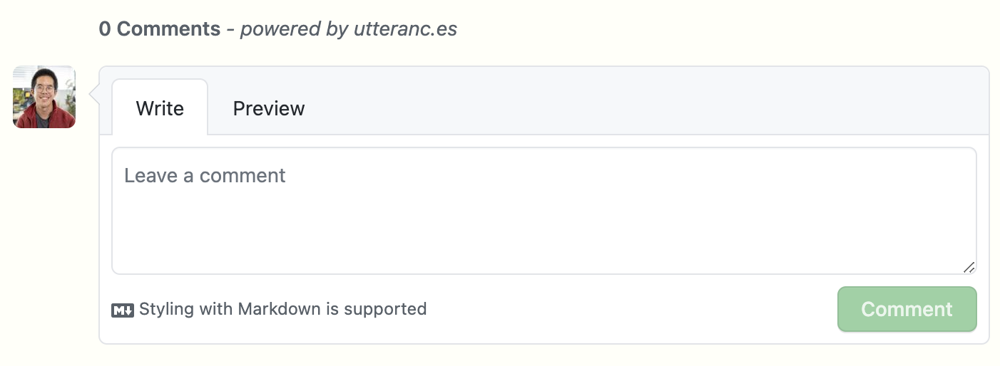

<section>

## What is Utterances?

On the previous iteration of my blog, I defaulted to use the Disqus plugin readily available in the Hugo ecosystem. This time I wanted a less bloated alternative and stumbled upon [Utterances](https://utteranc.es), a lightweight and open source GitHub comments widget built on GitHub issues. 

<figure>

<Marginnote id="utterances-preview" tag="p">
  This interface will most likely feel familiar to you. You can even write your comments in GitHub flavored markdown.
</Marginnote>



</figure>

Under the hood, the widget is linked to a public repository, which can be your blog's own repository if it is public, or an independent one if you prefer to keep the rest of your code private or if you wish to keep your blog comments separate from your blog's other issues. The `utterances-bot` creates an issue for each page where there are comments, and then appends each comment to this issue. As you might have guessed, any reader who wishes to post a comment has to sign-in to a GitHub account (which should not be too hard a constraint if your audience is mainly developers).

</section>

<section>

## Integrate Utterances to your Gatsby blog

Follow the simple instructions on the [official documentation](https://utteranc.es/). You can configure the title of the issues that the `utterances-bot` will create, and choose a theme that matches your blog (seven available as of the date of writing). Depending on your configuration, you should end up with a script...

```html
<script src="https://utteranc.es/client.js"
        repo="[ENTER REPO HERE]"
        issue-term="pathname"
        theme="github-light"
        crossorigin="anonymous"
        async>
</script>
```

...which is unfortunately not copy-pastable as is, since React does not support the `<script>` tag. There are dark ways to go around this, but a more elegant solution would be to implement it _the React way_; let's write a component!

<Marginnote id="comments-component">This script is <em>heavily</em> inspired by <a href="https://www.emgoto.com/gatsby-comments/" target="_blank" rel="noreferrer">Emma Goto's excellent blog</a>. Check it out for more Gatsby and React tips!</Marginnote>

```jsx:title=src/components/comments.js
import React, { useEffect } from "react";

const COMMENTS_ID = "comments-container";

const Comments = () => {
  useEffect(() => {
    const toggleDark = document.body.classList.contains("dark"); // highlight-line

    const script = document.createElement("script");
    script.src = "https://utteranc.es/client.js";
    // Replace with the repo on which you configured Utterances
    script.setAttribute("repo", "[ENTER REPO HERE]");
    script.setAttribute("issue-term", "pathname");
    script.setAttribute("theme", toggleDark? "icy-dark": "github-light"); // highlight-line
    script.setAttribute("crossorigin", "anonymous");
    script.async = true;

    const comments = document.getElementById(COMMENTS_ID);
    if (comments) comments.appendChild(script);

    return () => {
      const comments = document.getElementById(COMMENTS_ID);
      if (comments) comments.innerHTML = "";
    };
  }, []);

  return (
    <div id={COMMENTS_ID} />
  );
};

export default Comments;
```

As the created widget is actually an iframe, we cannot change its CSS properties ourselves directly. Another way of dynamically make its theme match your blog's is to add a toggle that will switch the theme according to the class of your `body` or `html` element, depending on how you implemented your dark theme toggle (see highlighted lines). For example, on this website, a "dark" class is added to the `body` element when you click on the sun/moon icon on the top right, which in turn triggers some color changes in my CSS file.

And voilà, now you can just import the `<Comments />` component you created anywhere you'd like. A good place would be at the bottom of your blog post template if you have one (mine is at `src/templates/blog-post.js`, as should be yours if you've used the `gatsby-starter-blog`).

</section>